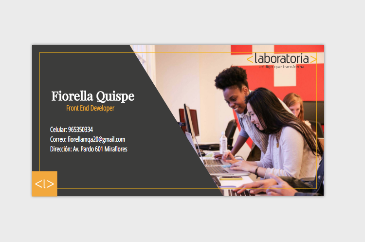

# Tarjeta de Presentación

Lección 23 - CSS Positioning [Proyecto Finalizado](https://fiorellaqa.github.io/Tarjeta-Presentacion/)

## Requerimientos

* El fondo consta de un div y una imagen, como podrás observar es un div con una forma no tan común. Investiga sobre : CSS3 Gradients
* El logo de Laboratoria en la parte inferior derecha es una imagen.
* Como es tu tarjeta de presentación debería de tener tus datos

